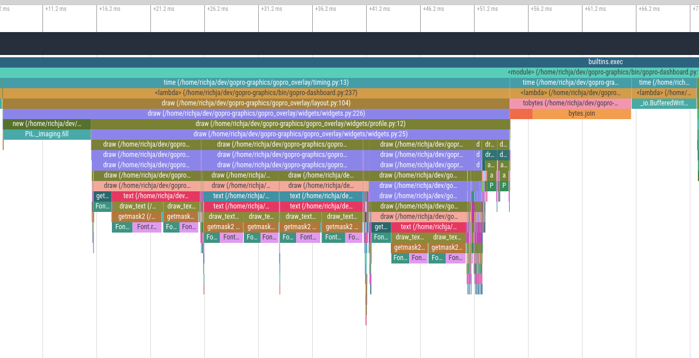

## Performance

Performance isn't really a major goal... Right now it processes video just a bit faster than realtime, so your 10 minute
video will probably take about 10 minutes to render. This is highly dependent on your CPU though.

For better performance, both the source and target files should be on a fast disk. Copy MP4 files from the SD card to local disk first - it will be much quicker. Use M2 drives if you have them.

The dashboard is updated every 0.1 seconds, regardless of the frame rate of the video, so 10 frames/s in this chart 
means 1 second of video is processed in 1 second.

These indicative figures are from Ubuntu on Intel Core i7-6700K CPU @ 4.00GHz with NVIDIA GeForce GTX 750 Ti

Here nvtop shows ENC is 100% in use.

| Performance Option    | Frames/s "null" | Frames/s normal | Frames/s --profile nvgpu |
|-----------------------|-----------------|-----------------|--------------------------|
| Default (python 3.8)  | ~30             | ~10             | ~21                      | 
| PyPy                  | ~27             |                 |                          |
| Default + Pillow SIMD | ~60             | ~10             | ~25                      |

These indicative figures are from Ubuntu on Intel(R) Core(TM) i9-9980HK CPU @ 2.40GHz with NVIDIA GeForce GTX 1650

Here nvtop shows that the ENC is only 25% in use, so further optimization would give benefit.

| Performance Option    | Frames/s "null" | Frames/s normal | Frames/s --profile nvgpu |
|-----------------------|-----------------|-----------------|--------------------------|
| Default (python 3.8)  | ~30             | ~18             | ~22                      | 

Using newer GPUs, the GPU is pretty much chilling, so perhaps using Pillow-SIMD will give a big boost.

### GPU

Using the `--profile` option you can get a lot of extra performance out of the software. Please see the section on 
FFMPEG profiles in [docs/bin](docs/bin)

### Pillow-SIMD

You might be able to get some more performance out of the program by using pillow-simd. Installing it is a bit more
complicated. You'll need a compiler etc. Follow the installation instructions
at https://github.com/uploadcare/pillow-simd#pillow-simd

Short version:
```bash
venv/bin/pip uninstall pillow
venv/bin/pip install pillow-simd==8.3.2.post0
```
The frame drawing rate is quite a bit faster, but won't make a huge difference unless GPU settings are used with ffmpeg.

No tests are run in this project with pillow-simd, so output may vary (but their tests are good, so I wouldn't expect any huge differences, if any)

### Things to look at



A few thoughts - timing dominated by:
 - Creating a new image on each frame
 - Font rendering
 - Encoding
 - Writing to ffmpeg

Perhaps can somehow move encoding and writing of frame to ffmpeg to another thread/process so can start rendering next frame while that is happening? (e.g. Double Buffer)
need to think about python GIL - so perhaps shared memory? 