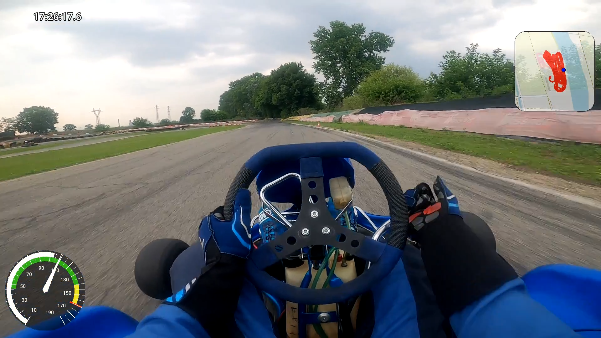
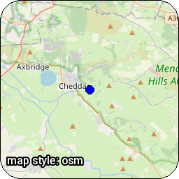

# Create video overlays from GoPro Videos or any GPX/FIT file

<a href="https://github.com/time4tea/gopro-dashboard-overlay/discussions"></a>
<a href="https://pypi.org/project/gopro-overlay/"></a>
<a href="https://hub.docker.com/r/overlaydash/gopro-dashboard-overlay"></a>

Discuss on [GitHub Discussions](https://github.com/time4tea/gopro-dashboard-overlay/discussions)

- Overlaying exciting graphics onto GoPro videos with super-exact synchronization
- *NEW & EXPERIMENTAL* Create videos from any GPX file - no GoPro required
- Support multiple resolutions, most GoPro models, normal, timelapse & timewarp modes
- Convert GoPro movie metadata to GPX or CSV files
- Cut sections from GoPro movies (including metadata)

## Examples





An Example of 'overlay only' mode, which generates movies from GPX files


## Map Styles

Almost 30 different map styles are supported! - See [map styles](docs/maps/README.md) for more

*Example*

| .                                   | .                                             | .                                                     | .                                                     |
|-------------------------------------|-----------------------------------------------|-------------------------------------------------------|-------------------------------------------------------|
|  |  |  |  |


## Requirements

- Python3.8
- ffmpeg (you'll need the ffmpeg program installed)
- Unixy machine (probably, untested on Windows)

## Installation

Install locally using `pip`, or use the provided Docker image

### Installing and running with docker

The docker image is a new thing and still a bit experimental... please file an issue if you find any problems.

The docker image contains all you need to get started, and uses a volume `/work/`, which we suggest you map to the current directory which can contain your GoPro
files.

```shell
docker run -v $(pwd):/work overlaydash/gopro-dashboard-overlay:<version> <program> [args...]
```

e.g.

```shell
docker run -v $(pwd):/work overlaydash/gopro-dashboard-overlay:0.64.0 gopro-dashboard.py GH010122.MP4 render/docker.MP4
```

Files created by the program will be created with the same uid that owns the mapped directory.

Note Currently you can't easily use "GPU Profiles" with the docker image - you'll need to map a Docker volume for the folder "/home/dash/.gopro-graphics"
to a suitable folder. This will be fixed in a later release.

### Installing and running with pip

```shell
python -m venv venv
venv/bin/pip install gopro-overlay
```

The Roboto font needs to be installed on your system. You could install it with one of the following commands maybe.

```bash
pacman -S ttf-roboto
apt install truetype-roboto
apt install fonts-roboto
```

## Overlaying a dashboard

```shell
venv/bin/gopro-dashboard.py
```

The GPS track in Hero 9 (at least) seems to be very poor. If you supply a GPX file from a Garmin or whatever, the
program will use this instead for the GPS.

Privacy allows you to set a privacy zone. Various widgets will not draw points within that zone.

The data recorded in the GoPro video will uses GPS time, which (broadly) is UTC. The renderer will use your local
timezone to interpret this, and use the local timezone. This may produce strange results if you go on holiday somewhere,
but then render the files when you get back home! On linux you can use the TZ variable to change the timezone that's
used.

### Example

For full instructions on all command lines see [docs/bin](docs/bin)

```shell
venv/bin/gopro-dashboard.py --gpx ~/Downloads/Morning_Ride.gpx --privacy 52.000,-0.40000,0.50 ~/gopro/GH020073.MP4 GH020073-dashboard.MP4
```

## Writeups

There's a great writeup of how to use the software to make an overlay from a GPX file at https://blog.cubieserver.de/2022/creating-gpx-overlay-videos-on-linux/
(Nov 2022)

### Format of the Dashboard Configuration file

Several dashboards are built-in to the software, but the dashboard layout is highly configurable, controlled by an XML
file.

For more information on the (extensive) configurability of the layout please see [docs/xml](docs/xml) and lots
of [examples](docs/xml/examples/README.md)

## FFMPEG Control & GPUs

*Experimental*

FFMPEG has **a lot** of options! This program comes with some mostly sensible defaults, but to use GPUs and control the
output much more carefully, including framerates and bitrates, you can use a JSON file containing a number of 'profiles'
and select the profile you want when running the program.

For more details on how to select these, and an example of Nvidia GPU, please see [docs/bin](docs/bin)

Please also see [PERFORMANCE.md](PERFORMANCE.md)

## Converting to GPX files

```shell
venv/bin/gopro-to-gpx.py <input-file> [output-file]
```

## Joining a sequence of MP4 files together

Use the gopro-join.py command. Given a single file from the sequence, it will find and join together all the files. If
you have any problems with this, please do raise an issue - I don't have that much test data.

The joined file almost certainly won't work in the GoPro tools! - But it should work with `gopro-dashboard.py` - I will
look into the additional technical stuff required to make it work in the GoPro tools.

*This will require a lot of disk space!*

```shell
venv/bin/gopro-join.py /media/sdcard/DCIM/100GOPRO/GH030170.MP4 /data/gopro/nice-ride.MP4
```

## Cutting a section from a GoPro file

You can cut a section of the gopro file, with metadata.

## Related Software

- https://github.com/julesgraus/interactiveGoProDashboardTool - An interactive helper to build the command line for the dashboard program

## Known Bugs / Issues

- Only tested on a GoPro Hero 9, that's all I have. Sample files for other devices are welcomed.

## Icons

Icon files in [icons](gopro_overlay/icons) are not covered by the MIT licence

## Map Data

Data © [OpenStreetMap contributors](http://www.openstreetmap.org/copyright)

Some Maps © [Thunderforest](http://www.thunderforest.com/)

## References

https://github.com/juanmcasillas/gopro2gpx

https://github.com/JuanIrache/gopro-telemetry

https://github.com/gopro/gpmf-parser

https://coderunner.io/how-to-compress-gopro-movies-and-keep-metadata/

## Other Related Software

https://github.com/progweb/gpx2video

https://github.com/JuanIrache/gopro-telemetry

## Latest Changes

If you find any issues with new releases, please discuss in [GitHub Discussions](https://github.com/time4tea/gopro-dashboard-overlay/discussions)

- 0.72.0 Fix #42 - Data out of sequence when using joined files. h/t [@IbnGit](https://github.com/IbnGit) 
- 0.71.0 Fix #84 - Error introduced when updating to use pathlib - Added test so shouldn't reoccur. h/t [@j0ker-npw](https://github.com/j0ker-npw) 
- 0.70.0 Using GPX/FIT files - file extension is now case insensitive - #83 - h/t [@j0ker-npw](https://github.com/j0ker-npw) 
- 0.69.0 
  - New Program:- gopro-layout.py
    - This should help if you want to create your own layouts. Just point this to a layout file, and it will render a frame each time the layout file changes, so you can see your changes "live"
    - Some layout examples are now in [examples/layout](examples/layout)
    - Minor tweaks to `text`, `metric` and `chart` to control outline width and colour
  - New widget type `circuit_map` shows a simple plot of the path, but no map graphics. See [docs/xml/examples/06-circuit-map](docs/xml/examples/06-circuit-map) 
- 0.68.0 EXPERIMENTAL support for FIT files - Use just like a GPX file, either supplementing the GoPro or by itself.
  - Not expecting any major issues, with FIT support, but I don't have a huge number of test files.
- 0.67.0 EXPERIMENTAL support for parsing camera orientation. This means it's now possible to show pitch/roll/yaw.
  - But I'm not 100% on the maths, particularly around the rotation axes - so maybe it's not quite right.
  - Use `ori.pich` `ori.roll` `ori.yaw` in widgets/metrics. They have a unit of radians - Feedback welcomed!
- 0.66.0 Fix #78 - Crash when GPS5 packets have zero entries.
  - Add accelerometer entries to csv output 
- 0.65.0 Parse "power" from GPX files. Thanks to [@kfhdk](https://github.com/kfhdk)
  - See [docs/xml/examples/07-metrics](docs/xml/examples/04-metrics) for examples of how to use
  - Also example layout in layouts/power-1920x1080.xml
- 0.64.0 Bump version only - no changes
  - Docker Image now available! - Thanks to [@GitFun4All](https://github.com/GitFun4All) for the suggestion and example code 
- 0.63.0 Bump version only - no changes
- 0.62.0 Bump version only - no changes
- 0.61.0 Update to Pillow version - should make the program run faster due to improvements in font rendering performance
- 0.60.0 Possible fix for error using --gpx-only in timezones that are ahead of UTC

Older changes are in [CHANGELOG.md](CHANGELOG.md)

