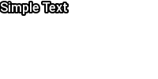
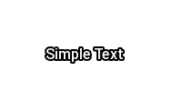
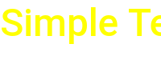
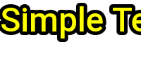
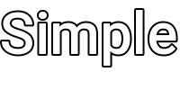

<!-- 

Auto Generated File DO NOT EDIT 

-->

# Simple Text

The text to render is just the element contents


```xml
<component type="text">Simple Text</component>
```
<kbd></kbd>


## Positioning

Use `x` and `y` to position text on the dashboard


```xml
<component type="text" x="50" y="50">Simple Text</component>
```
<kbd></kbd>


## Colour

Use `rgb` to control the colour of the text 


```xml
<component type="text" rgb="255,255,0">Simple Text</component>
```
<kbd></kbd>


## Transparency

`rgb` can also accept an 'alpha' value, from 0 (completely transparent) to 255 (completely opaque)


```xml
<component type="text" rgb="255,255,0,128">Simple Text</component>
```
<kbd></kbd>


## Size

Use `size` to control the font size.


```xml
<component type="text" size="64">Simple Text</component>
```
<kbd></kbd>


## Alignment

Use `align` to align


```xml
<composite>
  <component type="text" x="50" y="0" align="left">Left</component> 
  <component type="text" x="50" y="20" align="right">Right</component> 
</composite>
```
<kbd></kbd>


More complex alignments are possible. See [full documentation](https://pillow.readthedocs.io/en/stable/handbook/text-anchors.html)

## Direction

Use `direction` to change text direction. Right now, you need to specify `align` too. Here `lt` means "left-top"


```xml
<component type="text" align="lt" direction="ttb">Vertical</component>
```
<kbd></kbd>


